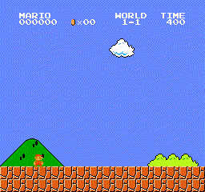

# Welcome!
This repo include a Super Mario Reinforcement Learning (RL) Training Colab notebook with Stable Baseline3 Library.

This is the [slides deck](https://docs.google.com/presentation/d/e/2PACX-1vRH3idUYN3IYpI7LmXL0_Y_VVkAtKUlOE2dUjVWcZokr2h7gKiBnKK1zDdKo5e5SqqBZtB198JW13Dq/pub?start=false&loop=false&delayms=3000).

- After 50k steps
  - 
- After 200k steps
  - 
- After 500k steps (success)!
  - 
- After 1 million steps (unstable, no success)
  - 
- After 1.5M steps (success again)
  - 
